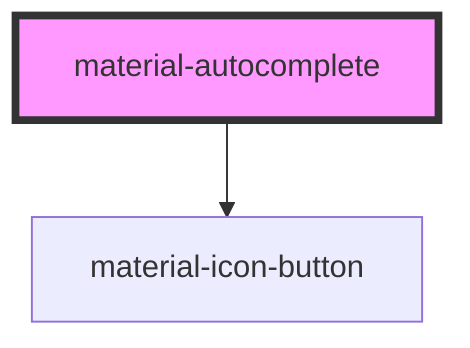

# material-autocomplete

Editable combobox over the select anatomy — filtering input, single or
`multiple` (chips) selection, form-associated. Strict: only option values
commit; free text reverts on blur (it is an FK picker, not a text input).

Three option sources:

```html
<!-- 1. slotted options (same markup as material-select), client-side filter -->
<material-autocomplete name="vendor" label="Vendor" required>
  <material-option value="1" selected>Acme Corp</material-option>
  <material-option value="2">Globex Ltd</material-option>
</material-autocomplete>

<!-- 2. remote endpoint: the server filters (?q=…), debounced + aborting.
     JSON: [{value,label}], {results:[…]} or select2-style {id,text}.
     Render the current selection as a slotted option so its label is
     known before the first fetch. -->
<material-autocomplete name="assignee" label="Assignee"
                       src="/users/autocomplete/" min-chars="2" multiple>
  <material-option value="7" selected>Grace Hopper</material-option>
</material-autocomplete>

<!-- 3. the `options` property (JS array) — or listen to `materialSearch`
     and swap the slotted options yourself for full transport control. -->
```

Keyboard: type to filter, `↑`/`↓` move the active row (focus stays in the
input — the listbox lives in the same shadow root so `aria-activedescendant`
works), `Enter` commits/toggles, `Esc` closes and reverts, `Backspace` on an
empty multi input removes the last chip. Multi keeps the listbox open on
toggle and posts one form entry per value (`request.POST.getlist(name)`).

<!-- Auto Generated Below -->


## Properties

| Property         | Attribute          | Description                                                                                                                | Type                                | Default      |
| ---------------- | ------------------ | -------------------------------------------------------------------------------------------------------------------------- | ----------------------------------- | ------------ |
| `clearLabel`     | `clear-label`      |                                                                                                                            | `string`                            | `''`         |
| `clearable`      | `clearable`        |                                                                                                                            | `boolean`                           | `false`      |
| `debounce`       | `debounce`         | Debounce for remote fetches, ms.                                                                                           | `number`                            | `250`        |
| `disabled`       | `disabled`         |                                                                                                                            | `boolean`                           | `false`      |
| `error`          | `error`            |                                                                                                                            | `boolean`                           | `false`      |
| `errorText`      | `error-text`       |                                                                                                                            | `string \| undefined`               | `undefined`  |
| `helpText`       | `help-text`        |                                                                                                                            | `string \| undefined`               | `undefined`  |
| `label`          | `label`            |                                                                                                                            | `string \| undefined`               | `undefined`  |
| `leadingIcon`    | `leading-icon`     |                                                                                                                            | `string \| undefined`               | `undefined`  |
| `loadingLabel`   | `loading-label`    |                                                                                                                            | `string`                            | `''`         |
| `minChars`       | `min-chars`        | Minimum typed characters before `src` is queried (0 = fetch on open).                                                      | `number`                            | `0`          |
| `multiple`       | `multiple`         | Chips + toggling options; posts one form entry per value.                                                                  | `boolean`                           | `false`      |
| `name`           | `name`             |                                                                                                                            | `string \| undefined`               | `undefined`  |
| `noResultsLabel` | `no-results-label` |                                                                                                                            | `string`                            | `''`         |
| `openLabel`      | `open-label`       |                                                                                                                            | `string`                            | `''`         |
| `options`        | --                 | Options provided from JS instead of slotted material-options.                                                              | `AutocompleteOption[] \| undefined` | `undefined`  |
| `placeholder`    | `placeholder`      |                                                                                                                            | `string \| undefined`               | `undefined`  |
| `queryParam`     | `query-param`      | Query-string parameter appended to `src`.                                                                                  | `string`                            | `'q'`        |
| `readOnly`       | `readonly`         |                                                                                                                            | `boolean`                           | `false`      |
| `required`       | `required`         |                                                                                                                            | `boolean`                           | `false`      |
| `src`            | `src`              | Remote JSON endpoint. When set, the server filters (`?q=` appended) and slotted/`options` lists only seed the label cache. | `string \| undefined`               | `undefined`  |
| `value`          | `value`            | Committed value (single mode) / CSV mirror (multi mode).                                                                   | `string`                            | `''`         |
| `values`         | --                 | Source of truth in multi mode — same contract as material-select.                                                          | `string[]`                          | `[]`         |
| `variant`        | `variant`          |                                                                                                                            | `"filled" \| "outlined"`            | `'outlined'` |


## Events

| Event            | Description | Type                                                |
| ---------------- | ----------- | --------------------------------------------------- |
| `materialSearch` |             | `CustomEvent<{ query: string; }>`                   |
| `openChange`     |             | `CustomEvent<{ open: boolean; }>`                   |
| `valueChange`    |             | `CustomEvent<{ value: string; values: string[]; }>` |


## Dependencies

### Depends on

- [material-icon-button](../material-icon-button)

### Graph


----------------------------------------------

*Built with [StencilJS](https://stenciljs.com/)*
