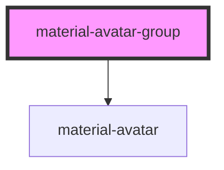

# material-avatar-group

<!-- Auto Generated Below -->

## Properties

| Property | Attribute | Description                                                     | Type                                | Default |
| -------- | --------- | --------------------------------------------------------------- | ----------------------------------- | ------- |
| `max`    | `max`     | Max visible avatars; the rest collapse into "+N". 0 = show all. | `number`                            | `4`     |
| `size`   | `size`    | Size applied to every slotted avatar and the overflow chip.     | `"l" \| "m" \| "s" \| "xl" \| "xs"` | `'m'`   |

## Dependencies

### Depends on

- [material-avatar](../material-avatar)

### Graph

----------------------------------------------

*Built with [StencilJS](https://stenciljs.com/)*
