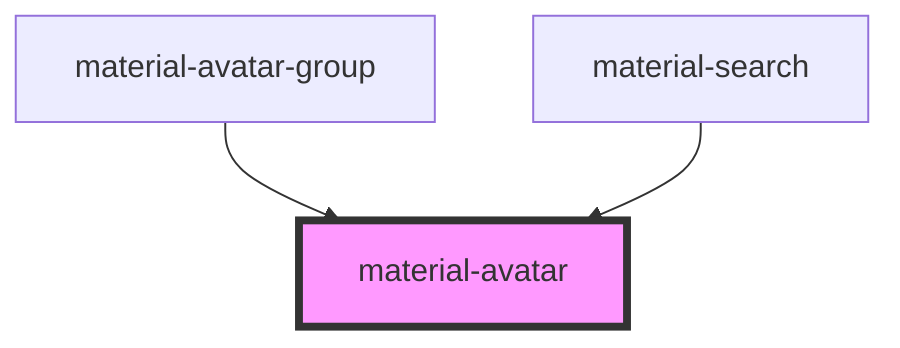

# material-avatar

<!-- Auto Generated Below -->

## Properties

| Property   | Attribute  | Description                                                         | Type                                                                                                                                    | Default     |
| ---------- | ---------- | ------------------------------------------------------------------- | --------------------------------------------------------------------------------------------------------------------------------------- | ----------- |
| `color`    | `color`    |                                                                     | `"auto" \| "primary" \| "primary-container" \| "secondary" \| "secondary-container" \| "surface" \| "tertiary" \| "tertiary-container"` | `'auto'`    |
| `icon`     | `icon`     | Material Symbols glyph used when there is no name and no image.     | `string`                                                                                                                                | `'person'`  |
| `initials` | `initials` | Override the derived initials (max ~2 chars look right).            | `string \| undefined`                                                                                                                   | `undefined` |
| `name`     | `name`     | Full name — drives derived initials, auto color and the aria-label. | `string \| undefined`                                                                                                                   | `undefined` |
| `size`     | `size`     | xs=24dp s=32dp m=40dp (default) l=48dp xl=64dp — rem-based.         | `"l" \| "m" \| "s" \| "xl" \| "xs"`                                                                                                     | `'m'`       |
| `src`      | `src`      | Image URL; falls back to initials/icon while loading or on error.   | `string \| undefined`                                                                                                                   | `undefined` |

## Dependencies

### Used by

 - [material-avatar-group](../material-avatar-group)
 - [material-search](../material-search)

### Graph

----------------------------------------------

*Built with [StencilJS](https://stenciljs.com/)*
