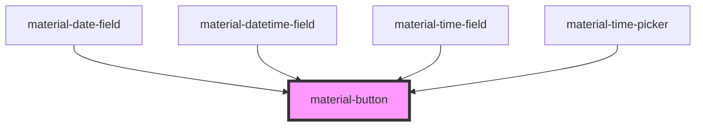

# material-button

<!-- Auto Generated Below -->

## Properties

| Property              | Attribute             | Description                                                                                                                                 | Type                                                        | Default     |
| --------------------- | --------------------- | ------------------------------------------------------------------------------------------------------------------------------------------- | ----------------------------------------------------------- | ----------- |
| `ariaLabel`           | `aria-label`          |                                                                                                                                             | `string \| undefined`                                       | `undefined` |
| `disabled`            | `disabled`            |                                                                                                                                             | `boolean`                                                   | `false`     |
| `download`            | `download`            |                                                                                                                                             | `string \| undefined`                                       | `undefined` |
| `href`                | `href`                |                                                                                                                                             | `string \| undefined`                                       | `undefined` |
| `icon`                | `icon`                |                                                                                                                                             | `string \| undefined`                                       | `undefined` |
| `label`               | `label`               |                                                                                                                                             | `string \| undefined`                                       | `undefined` |
| `name`                | `name`                |                                                                                                                                             | `string \| undefined`                                       | `undefined` |
| `popoverTarget`       | `popovertarget`       |                                                                                                                                             | `string \| undefined`                                       | `undefined` |
| `popoverTargetAction` | `popovertargetaction` |                                                                                                                                             | `"hide" \| "show" \| "toggle" \| undefined`                 | `undefined` |
| `rel`                 | `rel`                 |                                                                                                                                             | `string \| undefined`                                       | `undefined` |
| `shape`               | `shape`               | Resting corner shape. `round` is the pill default; `square` uses the small rounded-rect resting radius (parity with icon-button's `shape`). | `"round" \| "square"`                                       | `'round'`   |
| `shapeMorph`          | `shape-morph`         |                                                                                                                                             | `boolean`                                                   | `false`     |
| `size`                | `size`                |                                                                                                                                             | `"l" \| "m" \| "s" \| "xl" \| "xs"`                         | `'s'`       |
| `target`              | `target`              |                                                                                                                                             | `"_blank" \| "_parent" \| "_self" \| "_top" \| undefined`   | `undefined` |
| `trailingIcon`        | `trailing-icon`       |                                                                                                                                             | `string \| undefined`                                       | `undefined` |
| `type`                | `type`                |                                                                                                                                             | `"button" \| "reset" \| "submit"`                           | `'button'`  |
| `value`               | `value`               |                                                                                                                                             | `string \| undefined`                                       | `undefined` |
| `variant`             | `variant`             |                                                                                                                                             | `"elevated" \| "filled" \| "outlined" \| "text" \| "tonal"` | `'filled'`  |

## Shadow Parts

| Part       | Description |
| ---------- | ----------- |
| `"button"` |             |

## Dependencies

### Used by

 - [material-date-field](../material-date-field)
 - [material-datetime-field](../material-datetime-field)
 - [material-time-field](../material-time-field)
 - [material-time-picker](../material-time-picker)

### Graph

----------------------------------------------

*Built with [StencilJS](https://stenciljs.com/)*
