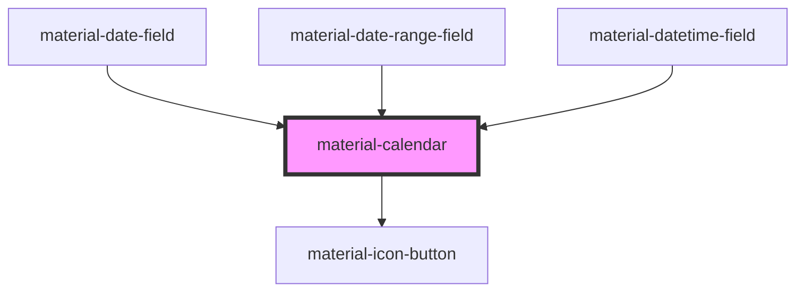

# material-calendar

<!-- Auto Generated Below -->

## Properties

| Property         | Attribute           | Description                                                                                                                                                                                                                    | Type                  | Default     |
| ---------------- | ------------------- | ------------------------------------------------------------------------------------------------------------------------------------------------------------------------------------------------------------------------------ | --------------------- | ----------- |
| `dense`          | `dense`             | Render the day grid with tight row heights instead of stretching the rows to fill the 360×456dp container. Useful when the calendar is embedded in a denser surface (e.g. inline in a form).                                   | `boolean`             | `false`     |
| `displayMonth`   | `display-month`     | Currently displayed month as `YYYY-MM`. Defaults to month-of(value) or current month.                                                                                                                                          | `string`              | `''`        |
| `endValue`       | `end-value`         | Range end, ISO `YYYY-MM-DD` (range mode). Empty while the second pick is still outstanding.                                                                                                                                    | `string`              | `''`        |
| `firstDayOfWeek` | `first-day-of-week` | First day of the week (0=Sun..6=Sat). Defaults via i18n helper.                                                                                                                                                                | `number \| undefined` | `undefined` |
| `locale`         | `locale`            | Override locale for month/weekday names. Defaults to <html lang> or `navigator.language`.                                                                                                                                      | `string`              | `''`        |
| `max`            | `max`               | Max selectable date (ISO).                                                                                                                                                                                                     | `string`              | `''`        |
| `maxYear`        | `max-year`          | Latest year shown in the year picker. Falls back to year-of-`max` when `max` is set, otherwise 2100.                                                                                                                           | `number \| undefined` | `undefined` |
| `min`            | `min`               | Min selectable date (ISO).                                                                                                                                                                                                     | `string`              | `''`        |
| `minYear`        | `min-year`          | Earliest year shown in the year picker. Falls back to year-of-`min` when `min` is set, otherwise 1900.                                                                                                                         | `number \| undefined` | `undefined` |
| `range`          | `range`             | Range-selection mode: the first pick sets `startValue`, the second sets `endValue`; picking a date before the start restarts the range. The in-between band renders in secondary-container per the MD3 date range picker spec. | `boolean`             | `false`     |
| `startValue`     | `start-value`       | Range start, ISO `YYYY-MM-DD` (range mode).                                                                                                                                                                                    | `string`              | `''`        |
| `value`          | `value`             | Selected date as ISO `YYYY-MM-DD`. Empty string = no selection. Ignored in `range` mode — see `startValue` / `endValue`.                                                                                                       | `string`              | `''`        |

## Events

| Event                | Description                                                            | Type                                           |
| -------------------- | ---------------------------------------------------------------------- | ---------------------------------------------- |
| `dateSelect`         |                                                                        | `CustomEvent<{ value: string; }>`              |
| `displayMonthChange` |                                                                        | `CustomEvent<{ value: string; }>`              |
| `rangeSelect`        | Range mode: emitted on every pick; `end` stays empty until the second. | `CustomEvent<{ start: string; end: string; }>` |

## Shadow Parts

| Part          | Description |
| ------------- | ----------- |
| `"container"` |             |

## Dependencies

### Used by

 - [material-date-field](../material-date-field)
 - [material-date-range-field](../material-date-range-field)
 - [material-datetime-field](../material-datetime-field)

### Depends on

- [material-icon-button](../material-icon-button)

### Graph

----------------------------------------------

*Built with [StencilJS](https://stenciljs.com/)*
