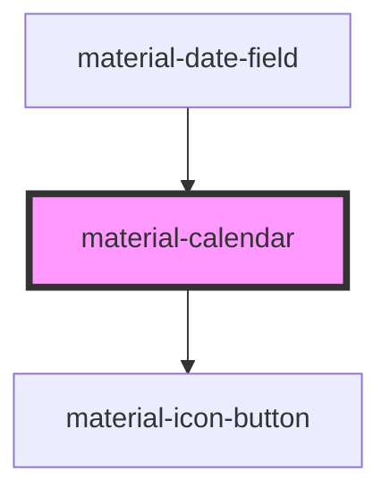

# material-calendar

<!-- Auto Generated Below -->

## Properties

| Property         | Attribute           | Description                                                                               | Type                  | Default     |
| ---------------- | ------------------- | ----------------------------------------------------------------------------------------- | --------------------- | ----------- |
| `displayMonth`   | `display-month`     | Currently displayed month as `YYYY-MM`. Defaults to month-of(value) or current month.     | `string`              | `''`        |
| `firstDayOfWeek` | `first-day-of-week` | First day of the week (0=Sun..6=Sat). Defaults via i18n helper.                           | `number \| undefined` | `undefined` |
| `locale`         | `locale`            | Override locale for month/weekday names. Defaults to <html lang> or `navigator.language`. | `string`              | `''`        |
| `max`            | `max`               | Max selectable date (ISO).                                                                | `string`              | `''`        |
| `min`            | `min`               | Min selectable date (ISO).                                                                | `string`              | `''`        |
| `value`          | `value`             | Selected date as ISO `YYYY-MM-DD`. Empty string = no selection.                           | `string`              | `''`        |

## Events

| Event                | Description | Type                              |
| -------------------- | ----------- | --------------------------------- |
| `dateSelect`         |             | `CustomEvent<{ value: string; }>` |
| `displayMonthChange` |             | `CustomEvent<{ value: string; }>` |

## Shadow Parts

| Part          | Description |
| ------------- | ----------- |
| `"container"` |             |

## Dependencies

### Used by

 - [material-date-field](../material-date-field)

### Depends on

- [material-icon-button](../material-icon-button)

### Graph

----------------------------------------------

*Built with [StencilJS](https://stenciljs.com/)*
