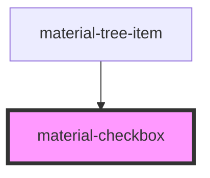

# material-checkbox

<!-- Auto Generated Below -->

## Properties

| Property        | Attribute       | Description                                                                                                                                                                                                                                                                 | Type                  | Default     |
| --------------- | --------------- | --------------------------------------------------------------------------------------------------------------------------------------------------------------------------------------------------------------------------------------------------------------------------- | --------------------- | ----------- |
| `ariaLabel`     | `aria-label`    |                                                                                                                                                                                                                                                                             | `string \| undefined` | `undefined` |
| `checked`       | `checked`       |                                                                                                                                                                                                                                                                             | `boolean`             | `false`     |
| `disabled`      | `disabled`      |                                                                                                                                                                                                                                                                             | `boolean`             | `false`     |
| `error`         | `error`         |                                                                                                                                                                                                                                                                             | `boolean`             | `false`     |
| `errorText`     | `error-text`    |                                                                                                                                                                                                                                                                             | `string \| undefined` | `undefined` |
| `helpText`      | `help-text`     |                                                                                                                                                                                                                                                                             | `string \| undefined` | `undefined` |
| `indeterminate` | `indeterminate` |                                                                                                                                                                                                                                                                             | `boolean`             | `false`     |
| `label`         | `label`         |                                                                                                                                                                                                                                                                             | `string \| undefined` | `undefined` |
| `name`          | `name`          |                                                                                                                                                                                                                                                                             | `string \| undefined` | `undefined` |
| `nested`        | `nested`        | Visual-only mode for composed widgets (a selectable list row): the inner button leaves the tab order — the enclosing widget drives the state and carries the semantics (aria-selected on the option). Still posts with the form. Set by material-list-item, rarely by hand. | `boolean`             | `false`     |
| `required`      | `required`      |                                                                                                                                                                                                                                                                             | `boolean`             | `false`     |
| `value`         | `value`         |                                                                                                                                                                                                                                                                             | `string`              | `'on'`      |

## Events

| Event           | Description | Type                                                         |
| --------------- | ----------- | ------------------------------------------------------------ |
| `checkedChange` |             | `CustomEvent<{ checked: boolean; indeterminate: boolean; }>` |

## Methods

### `toggle() => Promise<void>`

Programmatically toggle the checkbox as if a user clicked it.
Mirrors a real interaction: respects `disabled`, clears `indeterminate`
on first toggle, and emits `checkedChange`. Use this when another
component (e.g. a list-item handling Space) needs to drive the
checkbox without faking shadow-DOM clicks.

#### Returns

Type: `Promise<void>`

## Dependencies

### Used by

 - [material-tree-item](../material-tree)

### Graph

----------------------------------------------

*Built with [StencilJS](https://stenciljs.com/)*
