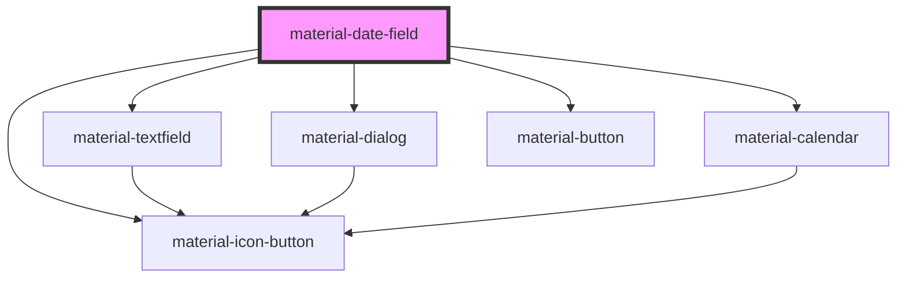

# material-date-field

<!-- Auto Generated Below -->

## Properties

| Property       | Attribute       | Description                                                                                                                                                                                                                                                                                                          | Type                     | Default      |
| -------------- | --------------- | -------------------------------------------------------------------------------------------------------------------------------------------------------------------------------------------------------------------------------------------------------------------------------------------------------------------- | ------------------------ | ------------ |
| `cancelLabel`  | `cancel-label`  | Override label for Cancel action. Defaults to `gettext('Cancel')`.                                                                                                                                                                                                                                                   | `string`                 | `''`         |
| `disabled`     | `disabled`      |                                                                                                                                                                                                                                                                                                                      | `boolean`                | `false`      |
| `error`        | `error`         |                                                                                                                                                                                                                                                                                                                      | `boolean`                | `false`      |
| `errorText`    | `error-text`    |                                                                                                                                                                                                                                                                                                                      | `string \| undefined`    | `undefined`  |
| `format`       | `format`        | strftime-style display format used when rendering `value` back into the textfield. Defaults to Django's `DATE_INPUT_FORMATS[0]` or a locale-derived one. Manual entry is more permissive — see `inputFormats`.                                                                                                       | `string`                 | `''`         |
| `headline`     | `headline`      | Override dialog headline. Defaults to `gettext('Select date')`.                                                                                                                                                                                                                                                      | `string`                 | `''`         |
| `helpText`     | `help-text`     |                                                                                                                                                                                                                                                                                                                      | `string \| undefined`    | `undefined`  |
| `inputFormats` | --              | Override the list of formats accepted on manual entry. Defaults to Django's full `DATE_INPUT_FORMATS` list (or `[format]` when Django's jsi18n catalog is not loaded). The lenient parser accepts mixed separators, 1- or 2-digit day/month, 2-digit years (00–68 → 20xx, 69–99 → 19xx), and month names regardless. | `string[] \| undefined`  | `undefined`  |
| `invalidLabel` | `invalid-label` | Override the error message shown when manual entry fails to parse. Defaults to `gettext('Invalid date')`.                                                                                                                                                                                                            | `string`                 | `''`         |
| `label`        | `label`         |                                                                                                                                                                                                                                                                                                                      | `string \| undefined`    | `undefined`  |
| `max`          | `max`           |                                                                                                                                                                                                                                                                                                                      | `string`                 | `''`         |
| `min`          | `min`           |                                                                                                                                                                                                                                                                                                                      | `string`                 | `''`         |
| `name`         | `name`          |                                                                                                                                                                                                                                                                                                                      | `string \| undefined`    | `undefined`  |
| `okLabel`      | `ok-label`      | Override label for OK action. Defaults to `gettext('OK')`.                                                                                                                                                                                                                                                           | `string`                 | `''`         |
| `openLabel`    | `open-label`    | Override aria-label of the trailing trigger. Defaults to `gettext('Open calendar')`.                                                                                                                                                                                                                                 | `string`                 | `''`         |
| `placeholder`  | `placeholder`   |                                                                                                                                                                                                                                                                                                                      | `string \| undefined`    | `undefined`  |
| `readOnly`     | `readonly`      |                                                                                                                                                                                                                                                                                                                      | `boolean`                | `false`      |
| `required`     | `required`      |                                                                                                                                                                                                                                                                                                                      | `boolean`                | `false`      |
| `value`        | `value`         | ISO `YYYY-MM-DD`. Always the canonical form for form posts.                                                                                                                                                                                                                                                          | `string`                 | `''`         |
| `variant`      | `variant`       |                                                                                                                                                                                                                                                                                                                      | `"filled" \| "outlined"` | `'outlined'` |

## Events

| Event         | Description | Type                              |
| ------------- | ----------- | --------------------------------- |
| `valueChange` |             | `CustomEvent<{ value: string; }>` |

## Dependencies

### Depends on

- [material-textfield](../material-textfield)
- [material-icon-button](../material-icon-button)
- [material-dialog](../material-dialog)
- [material-calendar](../material-calendar)
- [material-button](../material-button)

### Graph

----------------------------------------------

*Built with [StencilJS](https://stenciljs.com/)*
