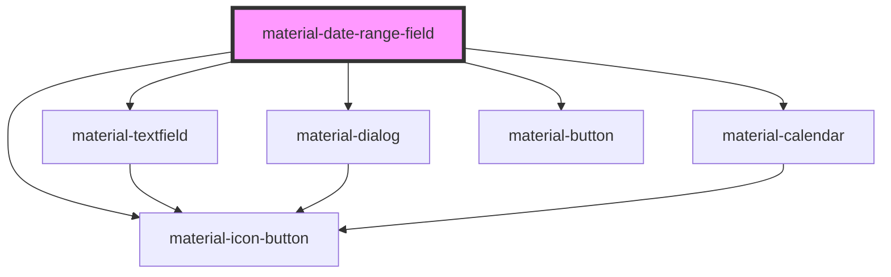

# material-date-range-field

<!-- Auto Generated Below -->

## Properties

| Property      | Attribute      | Description                                                     | Type                     | Default      |
| ------------- | -------------- | --------------------------------------------------------------- | ------------------------ | ------------ |
| `cancelLabel` | `cancel-label` |                                                                 | `string`                 | `''`         |
| `clearLabel`  | `clear-label`  |                                                                 | `string`                 | `''`         |
| `clearable`   | `clearable`    |                                                                 | `boolean`                | `false`      |
| `disabled`    | `disabled`     |                                                                 | `boolean`                | `false`      |
| `endName`     | `end-name`     | Form name for the end date's hidden input (e.g. `date_to`).     | `string \| undefined`    | `undefined`  |
| `endValue`    | `end-value`    | Range end, ISO `YYYY-MM-DD`.                                    | `string`                 | `''`         |
| `error`       | `error`        |                                                                 | `boolean`                | `false`      |
| `errorText`   | `error-text`   |                                                                 | `string \| undefined`    | `undefined`  |
| `format`      | `format`       | strftime-style display format, like material-date-field.        | `string`                 | `''`         |
| `headline`    | `headline`     |                                                                 | `string`                 | `''`         |
| `helpText`    | `help-text`    |                                                                 | `string \| undefined`    | `undefined`  |
| `label`       | `label`        |                                                                 | `string \| undefined`    | `undefined`  |
| `max`         | `max`          |                                                                 | `string`                 | `''`         |
| `min`         | `min`          |                                                                 | `string`                 | `''`         |
| `okLabel`     | `ok-label`     |                                                                 | `string`                 | `''`         |
| `openLabel`   | `open-label`   |                                                                 | `string`                 | `''`         |
| `placeholder` | `placeholder`  |                                                                 | `string \| undefined`    | `undefined`  |
| `readOnly`    | `readonly`     |                                                                 | `boolean`                | `false`      |
| `startName`   | `start-name`   | Form name for the start date's hidden input (e.g. `date_from`). | `string \| undefined`    | `undefined`  |
| `startValue`  | `start-value`  | Range start, ISO `YYYY-MM-DD`.                                  | `string`                 | `''`         |
| `variant`     | `variant`      |                                                                 | `"filled" \| "outlined"` | `'outlined'` |

## Events

| Event         | Description | Type                                           |
| ------------- | ----------- | ---------------------------------------------- |
| `valueChange` |             | `CustomEvent<{ start: string; end: string; }>` |

## Dependencies

### Depends on

- [material-textfield](../material-textfield)
- [material-icon-button](../material-icon-button)
- [material-dialog](../material-dialog)
- [material-calendar](../material-calendar)
- [material-button](../material-button)

### Graph

----------------------------------------------

*Built with [StencilJS](https://stenciljs.com/)*
