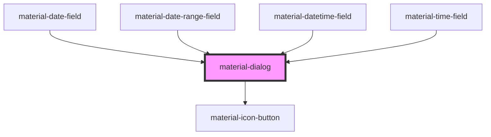

# material-dialog

<!-- Auto Generated Below -->

## Properties

| Property      | Attribute      | Description                                                                                                                 | Type                                                                                          | Default     |
| ------------- | -------------- | --------------------------------------------------------------------------------------------------------------------------- | --------------------------------------------------------------------------------------------- | ----------- |
| `alert`       | `alert`        | When true, the inner dialog uses role="alertdialog".                                                                        | `boolean`                                                                                     | `false`     |
| `dismissible` | `dismissible`  | When false, Esc and backdrop click do not close the dialog.                                                                 | `boolean`                                                                                     | `true`      |
| `headline`    | `headline`     | Headline text. Overridden by `slot="headline"` if provided.                                                                 | `string \| undefined`                                                                         | `undefined` |
| `icon`        | `icon`         | Material Symbols icon name for the basic variant. Overridden by `slot="icon"` if provided.                                  | `string \| undefined`                                                                         | `undefined` |
| `open`        | `open`         | Reflects open state. Toggling this prop drives showModal()/close().                                                         | `boolean`                                                                                     | `false`     |
| `position`    | `position`     | Basic-variant only. Edge positions respect a 56dp margin from the viewport per spec; ignored for full-screen.               | `"bottom" \| "bottom-end" \| "bottom-start" \| "center" \| "top" \| "top-end" \| "top-start"` | `'center'`  |
| `returnValue` | `return-value` | Mirrors the native dialog.returnValue after close.                                                                          | `string`                                                                                      | `''`        |
| `variant`     | `variant`      | `basic` (centered card), `full-screen` (full bleed), or `adaptive` (full-screen below the compact breakpoint, basic above). | `"adaptive" \| "basic" \| "full-screen"`                                                      | `'basic'`   |

## Events

| Event                  | Description | Type                                    |
| ---------------------- | ----------- | --------------------------------------- |
| `materialDialogCancel` |             | `CustomEvent<void>`                     |
| `materialDialogClose`  |             | `CustomEvent<{ returnValue: string; }>` |
| `materialDialogOpen`   |             | `CustomEvent<void>`                     |

## Methods

### `close(returnValue?: string) => Promise<void>`

Close the dialog, optionally setting the return value.

#### Parameters

| Name          | Type                  | Description |
| ------------- | --------------------- | ----------- |
| `returnValue` | `string \| undefined` |             |

#### Returns

Type: `Promise<void>`

### `show() => Promise<void>`

Open the dialog (modal).

#### Returns

Type: `Promise<void>`

## Shadow Parts

| Part       | Description |
| ---------- | ----------- |
| `"dialog"` |             |

## Dependencies

### Used by

 - [material-date-field](../material-date-field)
 - [material-date-range-field](../material-date-range-field)
 - [material-datetime-field](../material-datetime-field)
 - [material-time-field](../material-time-field)

### Depends on

- [material-icon-button](../material-icon-button)

### Graph

----------------------------------------------

*Built with [StencilJS](https://stenciljs.com/)*
