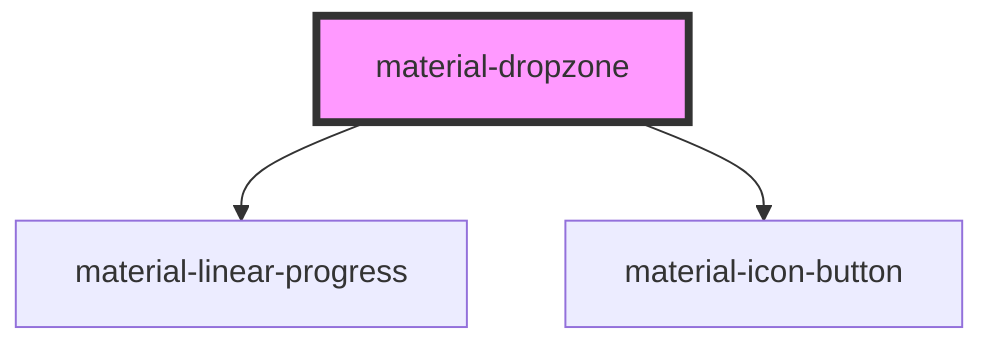

# material-dropzone

<!-- Auto Generated Below -->

## Properties

| Property            | Attribute      | Description                                                          | Type                  | Default     |
| ------------------- | -------------- | -------------------------------------------------------------------- | --------------------- | ----------- |
| `accept`            | `accept`       | Same syntax as the native attribute: "image/*,.pdf,application/zip". | `string \| undefined` | `undefined` |
| `browseLabel`       | `browse-label` |                                                                      | `string`              | `''`        |
| `disabled`          | `disabled`     |                                                                      | `boolean`             | `false`     |
| `dropLabel`         | `drop-label`   | Localized copy (defaults resolve through gettext / Django jsi18n).   | `string`              | `''`        |
| `error`             | `error`        |                                                                      | `boolean`             | `false`     |
| `errorText`         | `error-text`   |                                                                      | `string \| undefined` | `undefined` |
| `helpText`          | `help-text`    |                                                                      | `string \| undefined` | `undefined` |
| `maxFiles`          | `max-files`    | Total file count cap.                                                | `number \| undefined` | `undefined` |
| `maxSize`           | `max-size`     | Per-file size cap, bytes.                                            | `number \| undefined` | `undefined` |
| `multiple`          | `multiple`     |                                                                      | `boolean`             | `true`      |
| `name` _(required)_ | `name`         |                                                                      | `string`              | `undefined` |
| `removeLabel`       | `remove-label` |                                                                      | `string`              | `''`        |
| `required`          | `required`     |                                                                      | `boolean`             | `false`     |

## Events

| Event                | Description | Type                                                              |
| -------------------- | ----------- | ----------------------------------------------------------------- |
| `fileChange`         |             | `CustomEvent<{ files: File[]; added: File[]; removed: File[]; }>` |
| `materialFileAdd`    |             | `CustomEvent<{ file: File; }>`                                    |
| `materialFileReject` |             | `CustomEvent<{ file: File; reason: DropRejectReason; }>`          |

## Methods

### `clear() => Promise<void>`

#### Returns

Type: `Promise<void>`

### `getFiles() => Promise<File[]>`

#### Returns

Type: `Promise<File[]>`

### `setProgress(file: File, progress: number | "done" | "error", message?: string) => Promise<void>`

Drive the per-file progress UI: 0..100, 'done', or 'error' (+ message).

#### Parameters

| Name       | Type                          | Description |
| ---------- | ----------------------------- | ----------- |
| `file`     | `File`                        |             |
| `progress` | `number \| "error" \| "done"` |             |
| `message`  | `string \| undefined`         |             |

#### Returns

Type: `Promise<void>`

## Dependencies

### Depends on

- [material-linear-progress](../material-linear-progress)
- [material-icon-button](../material-icon-button)

### Graph

----------------------------------------------

*Built with [StencilJS](https://stenciljs.com/)*
