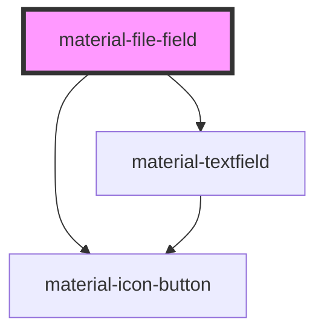

# material-file-field

<!-- Auto Generated Below -->

## Properties

| Property            | Attribute        | Description | Type                     | Default      |
| ------------------- | ---------------- | ----------- | ------------------------ | ------------ |
| `accept`            | `accept`         |             | `string \| undefined`    | `undefined`  |
| `changeLabel`       | `change-label`   |             | `string`                 | `''`         |
| `clearLabel`        | `clear-label`    |             | `string`                 | `''`         |
| `currentName`       | `current-name`   |             | `string \| undefined`    | `undefined`  |
| `currentUrl`        | `current-url`    |             | `string \| undefined`    | `undefined`  |
| `disabled`          | `disabled`       |             | `boolean`                | `false`      |
| `downloadLabel`     | `download-label` |             | `string`                 | `''`         |
| `error`             | `error`          |             | `boolean`                | `false`      |
| `errorText`         | `error-text`     |             | `string \| undefined`    | `undefined`  |
| `helpText`          | `help-text`      |             | `string \| undefined`    | `undefined`  |
| `label`             | `label`          |             | `string \| undefined`    | `undefined`  |
| `multiple`          | `multiple`       |             | `boolean`                | `false`      |
| `name` _(required)_ | `name`           |             | `string`                 | `undefined`  |
| `required`          | `required`       |             | `boolean`                | `false`      |
| `undoLabel`         | `undo-label`     |             | `string`                 | `''`         |
| `variant`           | `variant`        |             | `"filled" \| "outlined"` | `'outlined'` |

## Events

| Event        | Description | Type                                                     |
| ------------ | ----------- | -------------------------------------------------------- |
| `fileChange` |             | `CustomEvent<{ file: File \| null; cleared: boolean; }>` |

## Dependencies

### Depends on

- [material-textfield](../material-textfield)
- [material-icon-button](../material-icon-button)

### Graph

----------------------------------------------

*Built with [StencilJS](https://stenciljs.com/)*
