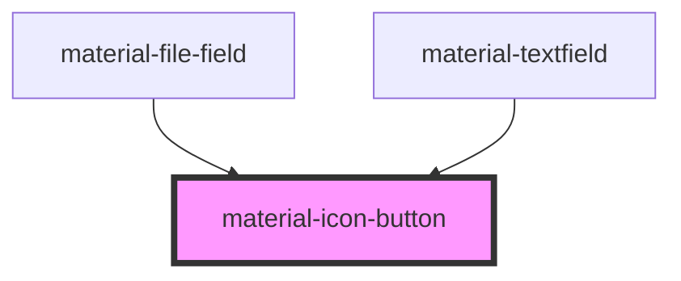

# material-icon-button

<!-- Auto Generated Below -->

## Properties

| Property            | Attribute       | Description | Type                                              | Default     |
| ------------------- | --------------- | ----------- | ------------------------------------------------- | ----------- |
| `ariaLabel`         | `aria-label`    |             | `string \| undefined`                             | `undefined` |
| `disabled`          | `disabled`      |             | `boolean`                                         | `false`     |
| `icon` _(required)_ | `icon`          |             | `string`                                          | `undefined` |
| `name`              | `name`          |             | `string \| undefined`                             | `undefined` |
| `selected`          | `selected`      |             | `boolean`                                         | `false`     |
| `selectedIcon`      | `selected-icon` |             | `string \| undefined`                             | `undefined` |
| `shape`             | `shape`         |             | `"round" \| "square"`                             | `'round'`   |
| `size`              | `size`          |             | `"l" \| "m" \| "s" \| "xl" \| "xs"`               | `'s'`       |
| `toggle`            | `toggle`        |             | `boolean`                                         | `false`     |
| `type`              | `type`          |             | `"button" \| "reset" \| "submit"`                 | `'button'`  |
| `value`             | `value`         |             | `string`                                          | `'on'`      |
| `variant`           | `variant`       |             | `"filled" \| "outlined" \| "standard" \| "tonal"` | `'filled'`  |
| `width`             | `width`         |             | `"default" \| "narrow" \| "wide"`                 | `'default'` |

## Events

| Event            | Description | Type                                  |
| ---------------- | ----------- | ------------------------------------- |
| `selectedChange` |             | `CustomEvent<{ selected: boolean; }>` |

## Dependencies

### Used by

 - [material-file-field](../material-file-field)
 - [material-textfield](../material-textfield)

### Graph

----------------------------------------------

*Built with [StencilJS](https://stenciljs.com/)*
