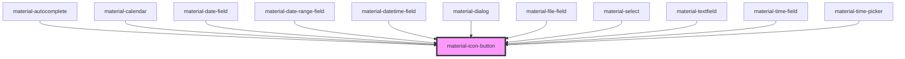

# material-icon-button

<!-- Auto Generated Below -->

## Properties

| Property              | Attribute             | Description | Type                                                      | Default     |
| --------------------- | --------------------- | ----------- | --------------------------------------------------------- | ----------- |
| `ariaLabel`           | `aria-label`          |             | `string \| undefined`                                     | `undefined` |
| `disabled`            | `disabled`            |             | `boolean`                                                 | `false`     |
| `download`            | `download`            |             | `string \| undefined`                                     | `undefined` |
| `href`                | `href`                |             | `string \| undefined`                                     | `undefined` |
| `icon` _(required)_   | `icon`                |             | `string`                                                  | `undefined` |
| `name`                | `name`                |             | `string \| undefined`                                     | `undefined` |
| `popoverTarget`       | `popovertarget`       |             | `string \| undefined`                                     | `undefined` |
| `popoverTargetAction` | `popovertargetaction` |             | `"hide" \| "show" \| "toggle" \| undefined`               | `undefined` |
| `rel`                 | `rel`                 |             | `string \| undefined`                                     | `undefined` |
| `selected`            | `selected`            |             | `boolean`                                                 | `false`     |
| `selectedIcon`        | `selected-icon`       |             | `string \| undefined`                                     | `undefined` |
| `shape`               | `shape`               |             | `"round" \| "square"`                                     | `'round'`   |
| `size`                | `size`                |             | `"l" \| "m" \| "s" \| "xl" \| "xs"`                       | `'s'`       |
| `target`              | `target`              |             | `"_blank" \| "_parent" \| "_self" \| "_top" \| undefined` | `undefined` |
| `toggle`              | `toggle`              |             | `boolean`                                                 | `false`     |
| `type`                | `type`                |             | `"button" \| "reset" \| "submit"`                         | `'button'`  |
| `value`               | `value`               |             | `string`                                                  | `'on'`      |
| `variant`             | `variant`             |             | `"filled" \| "outlined" \| "standard" \| "tonal"`         | `'filled'`  |
| `width`               | `width`               |             | `"default" \| "narrow" \| "wide"`                         | `'default'` |

## Events

| Event            | Description | Type                                  |
| ---------------- | ----------- | ------------------------------------- |
| `selectedChange` |             | `CustomEvent<{ selected: boolean; }>` |

## Shadow Parts

| Part            | Description |
| --------------- | ----------- |
| `"button"`      |             |
| `"state-layer"` |             |
| `"visual"`      |             |

## Dependencies

### Used by

 - [material-autocomplete](../material-autocomplete)
 - [material-calendar](../material-calendar)
 - [material-date-field](../material-date-field)
 - [material-date-range-field](../material-date-range-field)
 - [material-datetime-field](../material-datetime-field)
 - [material-dialog](../material-dialog)
 - [material-file-field](../material-file-field)
 - [material-select](../material-select)
 - [material-textfield](../material-textfield)
 - [material-time-field](../material-time-field)
 - [material-time-picker](../material-time-picker)

### Graph

----------------------------------------------

*Built with [StencilJS](https://stenciljs.com/)*
