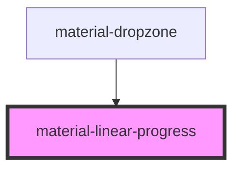

# material-linear-progress

<!-- Auto Generated Below -->

## Properties

| Property        | Attribute        | Description | Type                            | Default     |
| --------------- | ---------------- | ----------- | ------------------------------- | ----------- |
| `label`         | `label`          |             | `string \| undefined`           | `undefined` |
| `paused`        | `paused`         |             | `boolean`                       | `false`     |
| `stopIndicator` | `stop-indicator` |             | `"always" \| "auto" \| "never"` | `'auto'`    |
| `thickness`     | `thickness`      |             | `number`                        | `4`         |
| `value`         | `value`          |             | `number \| undefined`           | `undefined` |
| `wavy`          | `wavy`           |             | `boolean`                       | `false`     |

## Dependencies

### Used by

 - [material-dropzone](../material-dropzone)

### Graph

----------------------------------------------

*Built with [StencilJS](https://stenciljs.com/)*
