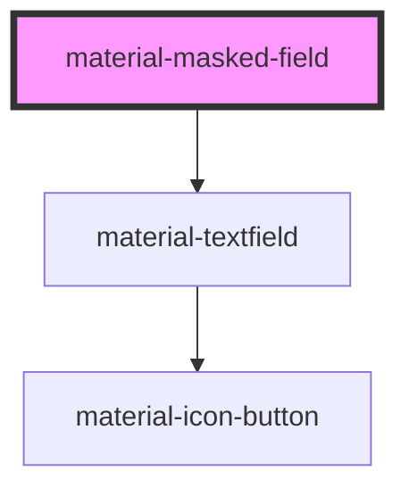

# material-masked-field

<!-- Auto Generated Below -->

## Properties

| Property            | Attribute          | Description                                                         | Type                     | Default      |
| ------------------- | ------------------ | ------------------------------------------------------------------- | ------------------------ | ------------ |
| `disabled`          | `disabled`         |                                                                     | `boolean`                | `false`      |
| `error`             | `error`            |                                                                     | `boolean`                | `false`      |
| `errorText`         | `error-text`       |                                                                     | `string \| undefined`    | `undefined`  |
| `helpText`          | `help-text`        |                                                                     | `string \| undefined`    | `undefined`  |
| `incompleteLabel`   | `incomplete-label` |                                                                     | `string`                 | `''`         |
| `label`             | `label`            |                                                                     | `string \| undefined`    | `undefined`  |
| `mask` _(required)_ | `mask`             | The pattern: `#` digit, `A` letter, `*` alnum, others literal.      | `string`                 | `undefined`  |
| `name`              | `name`             |                                                                     | `string \| undefined`    | `undefined`  |
| `placeholder`       | `placeholder`      | Placeholder; defaults to the mask with tokens as underscores.       | `string \| undefined`    | `undefined`  |
| `readOnly`          | `readonly`         |                                                                     | `boolean`                | `false`      |
| `required`          | `required`         |                                                                     | `boolean`                | `false`      |
| `unmask`            | `unmask`           | Post only the raw token characters instead of the formatted string. | `boolean`                | `false`      |
| `value`             | `value`            | Formatted value (mirrors what the field shows).                     | `string`                 | `''`         |
| `variant`           | `variant`          |                                                                     | `"filled" \| "outlined"` | `'outlined'` |

## Events

| Event         | Description | Type                                                              |
| ------------- | ----------- | ----------------------------------------------------------------- |
| `valueChange` |             | `CustomEvent<{ value: string; raw: string; complete: boolean; }>` |

## Dependencies

### Depends on

- [material-textfield](../material-textfield)

### Graph

----------------------------------------------

*Built with [StencilJS](https://stenciljs.com/)*
