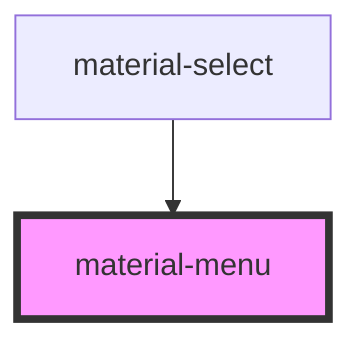

# material-menu

<!-- Auto Generated Below -->

## Properties

| Property    | Attribute    | Description                                                                                                                                       | Type                                                         | Default          |
| ----------- | ------------ | ------------------------------------------------------------------------------------------------------------------------------------------------- | ------------------------------------------------------------ | ---------------- |
| `anchor`    | `anchor`     | CSS selector or element id (without #) of the anchor. If omitted, the popover invoker (set by the browser when opened via popovertarget) is used. | `string \| undefined`                                        | `undefined`      |
| `maxHeight` | `max-height` | Hard cap on menu height in px; viewport room is the other ceiling.                                                                                | `number \| undefined`                                        | `undefined`      |
| `offset`    | `offset`     |                                                                                                                                                   | `number`                                                     | `4`              |
| `open`      | `open`       | Reflects open state. Toggling this prop drives the popover.                                                                                       | `boolean`                                                    | `false`          |
| `placement` | `placement`  |                                                                                                                                                   | `"bottom-end" \| "bottom-start" \| "top-end" \| "top-start"` | `'bottom-start'` |

## Events

| Event               | Description | Type                |
| ------------------- | ----------- | ------------------- |
| `materialMenuClose` |             | `CustomEvent<void>` |
| `materialMenuOpen`  |             | `CustomEvent<void>` |

## Methods

### `hide() => Promise<void>`

#### Returns

Type: `Promise<void>`

### `show(anchorEl?: Element) => Promise<void>`

Open the menu. Resolves the anchor from `el` arg, the `anchor` prop, or the popover invoker.

#### Parameters

| Name       | Type                   | Description |
| ---------- | ---------------------- | ----------- |
| `anchorEl` | `Element \| undefined` |             |

#### Returns

Type: `Promise<void>`

## Dependencies

### Used by

 - [material-select](../material-select)

### Graph

----------------------------------------------

*Built with [StencilJS](https://stenciljs.com/)*
