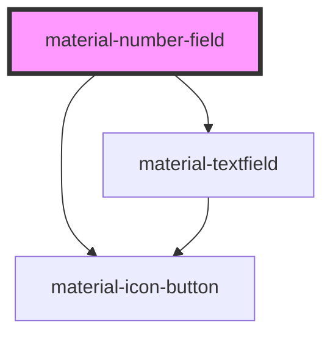

# material-number-field

<!-- Auto Generated Below -->

## Properties

| Property       | Attribute       | Description                                                                                                                                                                                                                                                 | Type                     | Default      |
| -------------- | --------------- | ----------------------------------------------------------------------------------------------------------------------------------------------------------------------------------------------------------------------------------------------------------- | ------------------------ | ------------ |
| `currency`     | `currency`      | ISO 4217 code ("USD", "EUR", "JPY"). Displays the value as locale currency — symbol placement, grouping and fraction digits all come from Intl (JPY → 0 digits, BHD → 3, …); explicit `decimals` wins. The posted value stays the plain dot-decimal string. | `string \| undefined`    | `undefined`  |
| `decimals`     | `decimals`      | Fraction digits shown/kept. Defaults to the step's precision (step 0.01 → 2).                                                                                                                                                                               | `number \| undefined`    | `undefined`  |
| `disabled`     | `disabled`      |                                                                                                                                                                                                                                                             | `boolean`                | `false`      |
| `error`        | `error`         |                                                                                                                                                                                                                                                             | `boolean`                | `false`      |
| `errorText`    | `error-text`    |                                                                                                                                                                                                                                                             | `string \| undefined`    | `undefined`  |
| `grouping`     | `grouping`      | Group thousands in the visible text (via Intl, `locale` or page locale). The posted value stays plain.                                                                                                                                                      | `boolean`                | `false`      |
| `helpText`     | `help-text`     |                                                                                                                                                                                                                                                             | `string \| undefined`    | `undefined`  |
| `invalidLabel` | `invalid-label` |                                                                                                                                                                                                                                                             | `string`                 | `''`         |
| `label`        | `label`         |                                                                                                                                                                                                                                                             | `string \| undefined`    | `undefined`  |
| `locale`       | `locale`        | BCP 47 tag. Empty = page locale (`<html lang>`, which Django's LocaleMiddleware sets); with Django's jsi18n catalog loaded the DECIMAL_SEPARATOR / THOUSAND_SEPARATOR formats win over Intl.                                                                | `string`                 | `''`         |
| `max`          | `max`           |                                                                                                                                                                                                                                                             | `number \| undefined`    | `undefined`  |
| `min`          | `min`           |                                                                                                                                                                                                                                                             | `number \| undefined`    | `undefined`  |
| `name`         | `name`          |                                                                                                                                                                                                                                                             | `string \| undefined`    | `undefined`  |
| `placeholder`  | `placeholder`   |                                                                                                                                                                                                                                                             | `string \| undefined`    | `undefined`  |
| `prefixText`   | `prefix-text`   | Static text inside the field, e.g. a currency sign or unit.                                                                                                                                                                                                 | `string \| undefined`    | `undefined`  |
| `readOnly`     | `readonly`      |                                                                                                                                                                                                                                                             | `boolean`                | `false`      |
| `required`     | `required`      |                                                                                                                                                                                                                                                             | `boolean`                | `false`      |
| `step`         | `step`          |                                                                                                                                                                                                                                                             | `number`                 | `1`          |
| `suffix`       | `suffix`        |                                                                                                                                                                                                                                                             | `string \| undefined`    | `undefined`  |
| `value`        | `value`         | Canonical value — dot-decimal string ("1234.5"), empty = no value.                                                                                                                                                                                          | `string`                 | `''`         |
| `variant`      | `variant`       |                                                                                                                                                                                                                                                             | `"filled" \| "outlined"` | `'outlined'` |

## Events

| Event         | Description | Type                                                      |
| ------------- | ----------- | --------------------------------------------------------- |
| `valueChange` |             | `CustomEvent<{ value: string; number: number \| null; }>` |

## Dependencies

### Depends on

- [material-textfield](../material-textfield)
- [material-icon-button](../material-icon-button)

### Graph

----------------------------------------------

*Built with [StencilJS](https://stenciljs.com/)*
