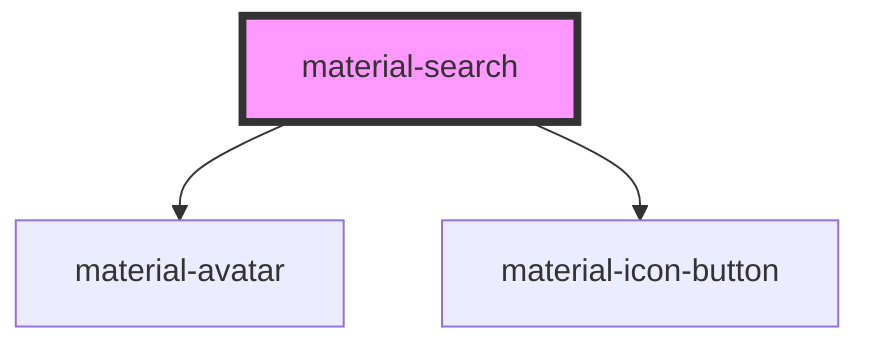

# material-search

<!-- Auto Generated Below -->

## Properties

| Property         | Attribute          | Description                                                             | Type                                 | Default     |
| ---------------- | ------------------ | ----------------------------------------------------------------------- | ------------------------------------ | ----------- |
| `ariaLabel`      | `aria-label`       |                                                                         | `string \| undefined`                | `undefined` |
| `backLabel`      | `back-label`       |                                                                         | `string`                             | `''`        |
| `clearLabel`     | `clear-label`      |                                                                         | `string`                             | `''`        |
| `clearable`      | `clearable`        | Show the × button while there is text (spec: optional clear icon).      | `boolean`                            | `true`      |
| `debounce`       | `debounce`         |                                                                         | `number`                             | `250`       |
| `disabled`       | `disabled`         |                                                                         | `boolean`                            | `false`     |
| `items`          | --                 | Suggestions provided from JS instead of slotted material-options.       | `SearchItem[] \| undefined`          | `undefined` |
| `layout`         | `layout`           | View layout: auto = full-screen on compact viewports, docked otherwise. | `"auto" \| "docked" \| "fullscreen"` | `'auto'`    |
| `loadingLabel`   | `loading-label`    |                                                                         | `string`                             | `''`        |
| `minChars`       | `min-chars`        |                                                                         | `number`                             | `0`         |
| `name`           | `name`             |                                                                         | `string \| undefined`                | `undefined` |
| `noResultsLabel` | `no-results-label` |                                                                         | `string`                             | `''`        |
| `placeholder`    | `placeholder`      |                                                                         | `string`                             | `'Search'`  |
| `queryParam`     | `query-param`      |                                                                         | `string`                             | `'q'`       |
| `src`            | `src`              | Remote JSON endpoint; the server filters (`?q=` appended).              | `string \| undefined`                | `undefined` |
| `upTarget`       | `up-target`        | `up-target` copied to the navigation anchor for href suggestions.       | `string \| undefined`                | `undefined` |
| `value`          | `value`            |                                                                         | `string`                             | `''`        |

## Events

| Event                  | Description | Type                                 |
| ---------------------- | ----------- | ------------------------------------ |
| `materialSearchInput`  |             | `CustomEvent<{ query: string; }>`    |
| `materialSearchSubmit` |             | `CustomEvent<{ query: string; }>`    |
| `materialSelect`       |             | `CustomEvent<{ item: SearchItem; }>` |
| `openChange`           |             | `CustomEvent<{ open: boolean; }>`    |

## Shadow Parts

| Part    | Description |
| ------- | ----------- |
| `"bar"` |             |

## Dependencies

### Depends on

- [material-avatar](../material-avatar)
- [material-icon-button](../material-icon-button)

### Graph

----------------------------------------------

*Built with [StencilJS](https://stenciljs.com/)*
