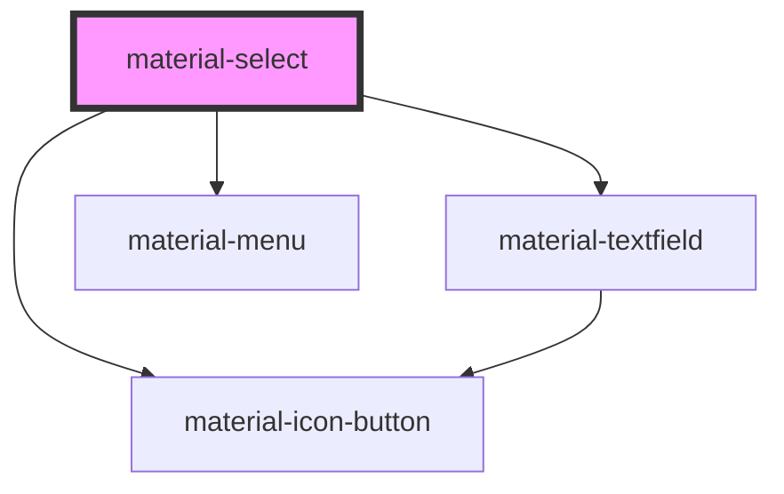

# material-select

<!-- Auto Generated Below -->

## Properties

| Property      | Attribute      | Description | Type                     | Default      |
| ------------- | -------------- | ----------- | ------------------------ | ------------ |
| `clearLabel`  | `clear-label`  |             | `string`                 | `''`         |
| `clearable`   | `clearable`    |             | `boolean`                | `false`      |
| `disabled`    | `disabled`     |             | `boolean`                | `false`      |
| `error`       | `error`        |             | `boolean`                | `false`      |
| `errorText`   | `error-text`   |             | `string \| undefined`    | `undefined`  |
| `helpText`    | `help-text`    |             | `string \| undefined`    | `undefined`  |
| `label`       | `label`        |             | `string \| undefined`    | `undefined`  |
| `leadingIcon` | `leading-icon` |             | `string \| undefined`    | `undefined`  |
| `multiple`    | `multiple`     |             | `boolean`                | `false`      |
| `name`        | `name`         |             | `string \| undefined`    | `undefined`  |
| `openLabel`   | `open-label`   |             | `string`                 | `''`         |
| `placeholder` | `placeholder`  |             | `string \| undefined`    | `undefined`  |
| `readOnly`    | `readonly`     |             | `boolean`                | `false`      |
| `required`    | `required`     |             | `boolean`                | `false`      |
| `value`       | `value`        |             | `string`                 | `''`         |
| `values`      | --             |             | `string[]`               | `[]`         |
| `variant`     | `variant`      |             | `"filled" \| "outlined"` | `'outlined'` |

## Events

| Event         | Description | Type                                                |
| ------------- | ----------- | --------------------------------------------------- |
| `openChange`  |             | `CustomEvent<{ open: boolean; }>`                   |
| `valueChange` |             | `CustomEvent<{ value: string; values: string[]; }>` |

## Dependencies

### Depends on

- [material-icon-button](../material-icon-button)
- [material-textfield](../material-textfield)
- [material-menu](../material-menu)

### Graph

----------------------------------------------

*Built with [StencilJS](https://stenciljs.com/)*
