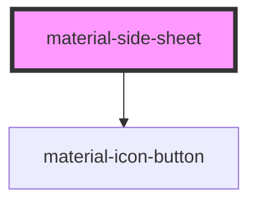

# material-side-sheet

<!-- Auto Generated Below -->

## Properties

| Property      | Attribute      | Description                                                        | Type                                  | Default     |
| ------------- | -------------- | ------------------------------------------------------------------ | ------------------------------------- | ----------- |
| `closeLabel`  | `close-label`  |                                                                    | `string`                              | `''`        |
| `dismissible` | `dismissible`  | Modal only: when false, Esc and scrim click do not close.          | `boolean`                             | `true`      |
| `headline`    | `headline`     | Headline text. Overridden by `slot="headline"` if provided.        | `string \| undefined`                 | `undefined` |
| `open`        | `open`         | Reflects open state.                                               | `boolean`                             | `false`     |
| `returnValue` | `return-value` | Mirrors the native dialog.returnValue after close (modal surface). | `string`                              | `''`        |
| `showClose`   | `show-close`   | Show the close icon button in the header.                          | `boolean`                             | `true`      |
| `variant`     | `variant`      |                                                                    | `"adaptive" \| "modal" \| "standard"` | `'modal'`   |

## Events

| Event                 | Description | Type                                    |
| --------------------- | ----------- | --------------------------------------- |
| `materialSheetCancel` |             | `CustomEvent<void>`                     |
| `materialSheetClose`  |             | `CustomEvent<{ returnValue: string; }>` |
| `materialSheetOpen`   |             | `CustomEvent<void>`                     |

## Methods

### `close(returnValue?: string) => Promise<void>`

Close the sheet, optionally setting the return value.

#### Parameters

| Name          | Type                  | Description |
| ------------- | --------------------- | ----------- |
| `returnValue` | `string \| undefined` |             |

#### Returns

Type: `Promise<void>`

### `show() => Promise<void>`

Open the sheet.

#### Returns

Type: `Promise<void>`

## Shadow Parts

| Part        | Description |
| ----------- | ----------- |
| `"actions"` |             |
| `"body"`    |             |
| `"header"`  |             |
| `"sheet"`   |             |

## Dependencies

### Depends on

- [material-icon-button](../material-icon-button)

### Graph

----------------------------------------------

*Built with [StencilJS](https://stenciljs.com/)*
