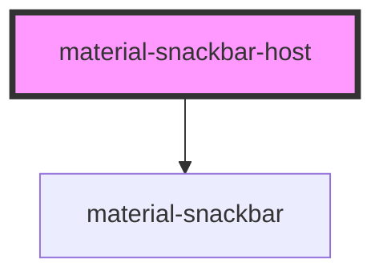

# material-snackbar-host

<!-- Auto Generated Below -->

## Properties

| Property    | Attribute   | Description                                                                                           | Type                                         | Default    |
| ----------- | ----------- | ----------------------------------------------------------------------------------------------------- | -------------------------------------------- | ---------- |
| `live`      | `live`      | Default ARIA live region politeness; `assertive: true` per request can raise it for a single message. | `"assertive" \| "polite"`                    | `'polite'` |
| `placement` | `placement` | Where the snackbar sits along the bottom edge.                                                        | `"bottom" \| "bottom-end" \| "bottom-start"` | `'bottom'` |

## Methods

### `clear() => Promise<void>`

Dismiss the current snackbar and drop everything queued.

#### Returns

Type: `Promise<void>`

### `enqueue(req: SnackbarRequest) => Promise<{ reason: MaterialSnackbarCloseReason; }>`

Enqueue a snackbar. Resolves with the close reason when the message is
eventually dismissed (timeout, action, close button, replaced by a
same-id update, or programmatic).

#### Parameters

| Name  | Type              | Description |
| ----- | ----------------- | ----------- |
| `req` | `SnackbarRequest` |             |

#### Returns

Type: `Promise<{ reason: MaterialSnackbarCloseReason; }>`

### `replace(id: string, partial: Partial<SnackbarRequest>) => Promise<void>`

Update fields of a visible or queued snackbar by id. No-op if not found.

#### Parameters

| Name      | Type                                                                                                                                                                                                                                          | Description |
| --------- | --------------------------------------------------------------------------------------------------------------------------------------------------------------------------------------------------------------------------------------------- | ----------- |
| `id`      | `string`                                                                                                                                                                                                                                      |             |
| `partial` | `{ message?: string \| undefined; actionLabel?: string \| undefined; onAction?: (() => unknown) \| undefined; closable?: boolean \| undefined; duration?: number \| undefined; assertive?: boolean \| undefined; id?: string \| undefined; }` |             |

#### Returns

Type: `Promise<void>`

## Dependencies

### Depends on

- [material-snackbar](../material-snackbar)

### Graph

----------------------------------------------

*Built with [StencilJS](https://stenciljs.com/)*
