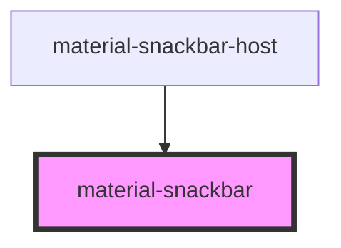

# material-snackbar

<!-- Auto Generated Below -->

## Properties

| Property      | Attribute      | Description                                                                                                                              | Type                  | Default     |
| ------------- | -------------- | ---------------------------------------------------------------------------------------------------------------------------------------- | --------------------- | ----------- |
| `actionLabel` | `action-label` | When set, renders a trailing text button.                                                                                                | `string \| undefined` | `undefined` |
| `closable`    | `closable`     | When true, renders a trailing close icon button next to (or instead of) the action button.                                               | `boolean`             | `false`     |
| `duration`    | `duration`     | Auto-dismiss timeout in ms. `0` disables auto-dismiss. Ignored when an action is present (action-bearing snackbars stay until acted on). | `number`              | `5000`      |
| `message`     | `message`      | Supporting text. Default slot also accepted; slot wins when both are set.                                                                | `string \| undefined` | `undefined` |
| `open`        | `open`         | Reflects open state. Toggling drives the enter/exit animation.                                                                           | `boolean`             | `false`     |

## Events

| Event                    | Description | Type                                                    |
| ------------------------ | ----------- | ------------------------------------------------------- |
| `materialSnackbarAction` |             | `CustomEvent<void>`                                     |
| `materialSnackbarClose`  |             | `CustomEvent<{ reason: MaterialSnackbarCloseReason; }>` |
| `materialSnackbarOpen`   |             | `CustomEvent<void>`                                     |

## Methods

### `close(reason?: MaterialSnackbarCloseReason) => Promise<void>`

Close the snackbar with an optional reason.

#### Parameters

| Name     | Type                                                               | Description |
| -------- | ------------------------------------------------------------------ | ----------- |
| `reason` | `"action" \| "close" \| "timeout" \| "replaced" \| "programmatic"` |             |

#### Returns

Type: `Promise<void>`

### `show() => Promise<void>`

Open the snackbar.

#### Returns

Type: `Promise<void>`

## Shadow Parts

| Part          | Description |
| ------------- | ----------- |
| `"action"`    |             |
| `"close"`     |             |
| `"container"` |             |

## Dependencies

### Used by

 - [material-snackbar-host](../material-snackbar-host)

### Graph

----------------------------------------------

*Built with [StencilJS](https://stenciljs.com/)*
