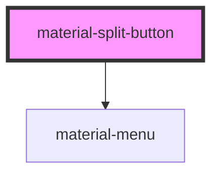

# material-split-button

<!-- Auto Generated Below -->

## Properties

| Property    | Attribute    | Description | Type                                                      | Default          |
| ----------- | ------------ | ----------- | --------------------------------------------------------- | ---------------- |
| `ariaLabel` | `aria-label` |             | `string \| undefined`                                     | `undefined`      |
| `disabled`  | `disabled`   |             | `boolean`                                                 | `false`          |
| `download`  | `download`   |             | `string \| undefined`                                     | `undefined`      |
| `href`      | `href`       |             | `string \| undefined`                                     | `undefined`      |
| `icon`      | `icon`       |             | `string \| undefined`                                     | `undefined`      |
| `label`     | `label`      |             | `string \| undefined`                                     | `undefined`      |
| `menuLabel` | `menu-label` |             | `string`                                                  | `'More options'` |
| `name`      | `name`       |             | `string \| undefined`                                     | `undefined`      |
| `rel`       | `rel`        |             | `string \| undefined`                                     | `undefined`      |
| `size`      | `size`       |             | `"l" \| "m" \| "s" \| "xl" \| "xs"`                       | `'s'`            |
| `target`    | `target`     |             | `"_blank" \| "_parent" \| "_self" \| "_top" \| undefined` | `undefined`      |
| `type`      | `type`       |             | `"button" \| "reset" \| "submit"`                         | `'button'`       |
| `value`     | `value`      |             | `string \| undefined`                                     | `undefined`      |
| `variant`   | `variant`    |             | `"elevated" \| "filled" \| "outlined" \| "tonal"`         | `'filled'`       |

## Events

| Event            | Description | Type                |
| ---------------- | ----------- | ------------------- |
| `splitAction`    |             | `CustomEvent<void>` |
| `splitMenuClose` |             | `CustomEvent<void>` |
| `splitMenuOpen`  |             | `CustomEvent<void>` |

## Shadow Parts

| Part         | Description |
| ------------ | ----------- |
| `"leading"`  |             |
| `"trailing"` |             |

## Dependencies

### Depends on

- [material-menu](../material-menu)

### Graph

----------------------------------------------

*Built with [StencilJS](https://stenciljs.com/)*
