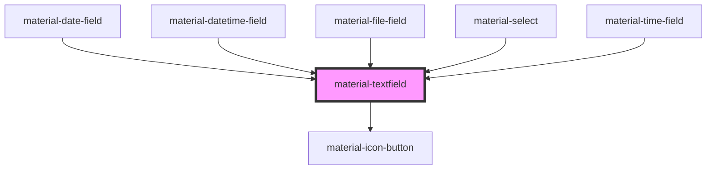

# material-textfield

<!-- Auto Generated Below -->

## Properties

| Property         | Attribute         | Description | Type                                                                        | Default      |
| ---------------- | ----------------- | ----------- | --------------------------------------------------------------------------- | ------------ |
| `ariaLabel`      | `aria-label`      |             | `string \| undefined`                                                       | `undefined`  |
| `dimmed`         | `dimmed`          |             | `boolean`                                                                   | `false`      |
| `disabled`       | `disabled`        |             | `boolean`                                                                   | `false`      |
| `error`          | `error`           |             | `boolean`                                                                   | `false`      |
| `errorText`      | `error-text`      |             | `string \| undefined`                                                       | `undefined`  |
| `helpText`       | `help-text`       |             | `string \| undefined`                                                       | `undefined`  |
| `label`          | `label`           |             | `string \| undefined`                                                       | `undefined`  |
| `leadingIcon`    | `leading-icon`    |             | `string \| undefined`                                                       | `undefined`  |
| `leadingText`    | `leading-text`    |             | `string \| undefined`                                                       | `undefined`  |
| `maxLength`      | `max-length`      |             | `number \| undefined`                                                       | `undefined`  |
| `name`           | `name`            |             | `string \| undefined`                                                       | `undefined`  |
| `passwordToggle` | `password-toggle` |             | `boolean`                                                                   | `false`      |
| `placeholder`    | `placeholder`     |             | `string \| undefined`                                                       | `undefined`  |
| `readOnly`       | `readonly`        |             | `boolean`                                                                   | `false`      |
| `required`       | `required`        |             | `boolean`                                                                   | `false`      |
| `trailingIcon`   | `trailing-icon`   |             | `string \| undefined`                                                       | `undefined`  |
| `trailingText`   | `trailing-text`   |             | `string \| undefined`                                                       | `undefined`  |
| `type`           | `type`            |             | `"email" \| "number" \| "password" \| "search" \| "tel" \| "text" \| "url"` | `'text'`     |
| `value`          | `value`           |             | `string`                                                                    | `''`         |
| `variant`        | `variant`         |             | `"filled" \| "outlined"`                                                    | `'outlined'` |
| `wideTrailing`   | `wide-trailing`   |             | `boolean`                                                                   | `false`      |

## Events

| Event         | Description | Type                              |
| ------------- | ----------- | --------------------------------- |
| `valueChange` |             | `CustomEvent<{ value: string; }>` |
| `valueInput`  |             | `CustomEvent<{ value: string; }>` |

## Dependencies

### Used by

 - [material-date-field](../material-date-field)
 - [material-datetime-field](../material-datetime-field)
 - [material-file-field](../material-file-field)
 - [material-select](../material-select)
 - [material-time-field](../material-time-field)

### Depends on

- [material-icon-button](../material-icon-button)

### Graph

----------------------------------------------

*Built with [StencilJS](https://stenciljs.com/)*
