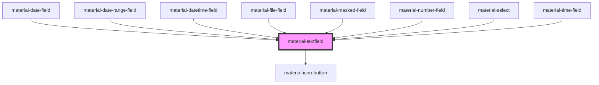

# material-textfield

<!-- Auto Generated Below -->

## Properties

| Property         | Attribute         | Description | Type                                                                        | Default      |
| ---------------- | ----------------- | ----------- | --------------------------------------------------------------------------- | ------------ |
| `ariaLabel`      | `aria-label`      |             | `string \| undefined`                                                       | `undefined`  |
| `dimmed`         | `dimmed`          |             | `boolean`                                                                   | `false`      |
| `disabled`       | `disabled`        |             | `boolean`                                                                   | `false`      |
| `error`          | `error`           |             | `boolean`                                                                   | `false`      |
| `errorText`      | `error-text`      |             | `string \| undefined`                                                       | `undefined`  |
| `helpText`       | `help-text`       |             | `string \| undefined`                                                       | `undefined`  |
| `label`          | `label`           |             | `string \| undefined`                                                       | `undefined`  |
| `leadingIcon`    | `leading-icon`    |             | `string \| undefined`                                                       | `undefined`  |
| `leadingText`    | `leading-text`    |             | `string \| undefined`                                                       | `undefined`  |
| `maxLength`      | `max-length`      |             | `number \| undefined`                                                       | `undefined`  |
| `name`           | `name`            |             | `string \| undefined`                                                       | `undefined`  |
| `passwordToggle` | `password-toggle` |             | `boolean`                                                                   | `false`      |
| `placeholder`    | `placeholder`     |             | `string \| undefined`                                                       | `undefined`  |
| `readOnly`       | `readonly`        |             | `boolean`                                                                   | `false`      |
| `required`       | `required`        |             | `boolean`                                                                   | `false`      |
| `trailingIcon`   | `trailing-icon`   |             | `string \| undefined`                                                       | `undefined`  |
| `trailingText`   | `trailing-text`   |             | `string \| undefined`                                                       | `undefined`  |
| `type`           | `type`            |             | `"email" \| "number" \| "password" \| "search" \| "tel" \| "text" \| "url"` | `'text'`     |
| `value`          | `value`           |             | `string`                                                                    | `''`         |
| `variant`        | `variant`         |             | `"filled" \| "outlined"`                                                    | `'outlined'` |
| `wideTrailing`   | `wide-trailing`   |             | `boolean`                                                                   | `false`      |

## Events

| Event         | Description | Type                              |
| ------------- | ----------- | --------------------------------- |
| `valueChange` |             | `CustomEvent<{ value: string; }>` |
| `valueInput`  |             | `CustomEvent<{ value: string; }>` |

## Methods

### `checkValidity() => Promise<boolean>`

Constraint validation, like a native input.

#### Returns

Type: `Promise<boolean>`

### `focusInput() => Promise<void>`

Focuses the inner input without colliding with HTMLElement#focus().

#### Returns

Type: `Promise<void>`

### `getSelectionRange() => Promise<{ start: number | null; end: number | null; direction: "forward" | "backward" | "none" | null; }>`

Reads the current selection. A native input exposes selectionStart /
selectionEnd / selectionDirection as sync property getter/setters —
Stencil's

#### Returns

Type: `Promise<{ start: number | null; end: number | null; direction: "none" | "forward" | "backward" | null; }>`

### `reportValidity() => Promise<boolean>`

Constraint validation. Unlike a native input, an invalid result renders
the MD3 inline error (error + errorText) instead of the native bubble —
see the `invalid` listener below.

#### Returns

Type: `Promise<boolean>`

### `select() => Promise<void>`

Selects all the text in the input, like a native input's `select()`.

#### Returns

Type: `Promise<void>`

### `setCustomValidity(message: string) => Promise<void>`

Sets a custom validity message, like a native input's
`setCustomValidity()`. Non-empty always wins over constraint checks and
keeps the control invalid — until cleared by calling this again with
`''`. Only takes effect in the UI on the next report (reportValidity()
or a form submit attempt), matching native behavior.

#### Parameters

| Name      | Type     | Description |
| --------- | -------- | ----------- |
| `message` | `string` |             |

#### Returns

Type: `Promise<void>`

### `setRangeText(replacement: string, start?: number, end?: number, selectMode?: "select" | "start" | "end" | "preserve") => Promise<void>`

Replaces a range of text with a new string, like a native input's
`setRangeText()`. Mirrors the value back onto `value` afterward since
it edits the input directly. No-op before first render.

#### Parameters

| Name          | Type                                                      | Description |
| ------------- | --------------------------------------------------------- | ----------- |
| `replacement` | `string`                                                  |             |
| `start`       | `number \| undefined`                                     |             |
| `end`         | `number \| undefined`                                     |             |
| `selectMode`  | `"select" \| "start" \| "end" \| "preserve" \| undefined` |             |

#### Returns

Type: `Promise<void>`

### `setSelectionRange(start: number | null, end: number | null, direction?: "forward" | "backward" | "none") => Promise<void>`

Sets the start/end/direction of the input's text selection, like a
native input's `setSelectionRange()`. No-op before first render.

#### Parameters

| Name        | Type                                             | Description |
| ----------- | ------------------------------------------------ | ----------- |
| `start`     | `number \| null`                                 |             |
| `end`       | `number \| null`                                 |             |
| `direction` | `"none" \| "forward" \| "backward" \| undefined` |             |

#### Returns

Type: `Promise<void>`

## Dependencies

### Used by

 - [material-date-field](../material-date-field)
 - [material-date-range-field](../material-date-range-field)
 - [material-datetime-field](../material-datetime-field)
 - [material-file-field](../material-file-field)
 - [material-masked-field](../material-masked-field)
 - [material-number-field](../material-number-field)
 - [material-select](../material-select)
 - [material-time-field](../material-time-field)

### Depends on

- [material-icon-button](../material-icon-button)

### Graph

----------------------------------------------

*Built with [StencilJS](https://stenciljs.com/)*
