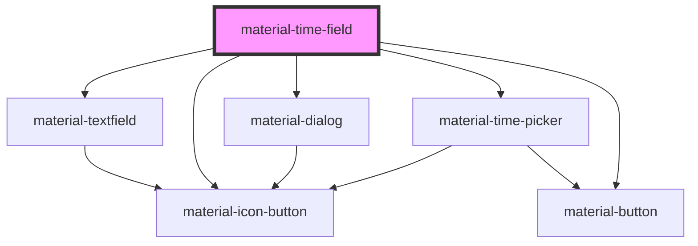

# material-time-field

<!-- Auto Generated Below -->

## Properties

| Property       | Attribute       | Description                                                                                                                                                                                                                                                                                                                                | Type                        | Default      |
| -------------- | --------------- | ------------------------------------------------------------------------------------------------------------------------------------------------------------------------------------------------------------------------------------------------------------------------------------------------------------------------------------------ | --------------------------- | ------------ |
| `cancelLabel`  | `cancel-label`  |                                                                                                                                                                                                                                                                                                                                            | `string`                    | `''`         |
| `disabled`     | `disabled`      |                                                                                                                                                                                                                                                                                                                                            | `boolean`                   | `false`      |
| `error`        | `error`         |                                                                                                                                                                                                                                                                                                                                            | `boolean`                   | `false`      |
| `errorText`    | `error-text`    |                                                                                                                                                                                                                                                                                                                                            | `string \| undefined`       | `undefined`  |
| `format`       | `format`        | strftime-style display format used when rendering `value` back into the textfield. Defaults to `%H:%M` (24h) or `%I:%M %p` (12h). Manual entry is more permissive — see `inputFormats`.                                                                                                                                                    | `string`                    | `''`         |
| `headline`     | `headline`      | Optional headline override for the picker. Defaults to localised "Select time" / "Enter time" depending on the picker's current view.                                                                                                                                                                                                      | `string`                    | `''`         |
| `helpText`     | `help-text`     |                                                                                                                                                                                                                                                                                                                                            | `string \| undefined`       | `undefined`  |
| `inputFormats` | --              | Override the list of formats accepted on manual entry. Defaults to Django's `TIME_INPUT_FORMATS` list (or a synthesised set covering both 12h and 24h shapes when Django's jsi18n catalog is not loaded). The lenient parser accepts mixed separators, 1- or 2-digit hours/minutes, compact `HHMM`, and case-insensitive AM/PM regardless. | `string[] \| undefined`     | `undefined`  |
| `invalidLabel` | `invalid-label` |                                                                                                                                                                                                                                                                                                                                            | `string`                    | `''`         |
| `label`        | `label`         |                                                                                                                                                                                                                                                                                                                                            | `string \| undefined`       | `undefined`  |
| `maximum`      | `maximum`       | Latest selectable time as `HH:MM`. Empty = no upper bound.                                                                                                                                                                                                                                                                                 | `string`                    | `''`         |
| `minimum`      | `minimum`       | Earliest selectable time as `HH:MM`. Empty = no lower bound.                                                                                                                                                                                                                                                                               | `string`                    | `''`         |
| `mode`         | `mode`          | `'12'` (AM/PM) or `'24'`. Defaults to the locale via Intl.                                                                                                                                                                                                                                                                                 | `"12" \| "24" \| undefined` | `undefined`  |
| `name`         | `name`          |                                                                                                                                                                                                                                                                                                                                            | `string \| undefined`       | `undefined`  |
| `okLabel`      | `ok-label`      |                                                                                                                                                                                                                                                                                                                                            | `string`                    | `''`         |
| `openLabel`    | `open-label`    |                                                                                                                                                                                                                                                                                                                                            | `string`                    | `''`         |
| `placeholder`  | `placeholder`   |                                                                                                                                                                                                                                                                                                                                            | `string \| undefined`       | `undefined`  |
| `precision`    | `precision`     | Step granularity as `HH:MM`. `00:15` = quarter-hour steps. Default `00:01` allows any minute.                                                                                                                                                                                                                                              | `string`                    | `'00:01'`    |
| `readOnly`     | `readonly`      |                                                                                                                                                                                                                                                                                                                                            | `boolean`                   | `false`      |
| `required`     | `required`      |                                                                                                                                                                                                                                                                                                                                            | `boolean`                   | `false`      |
| `value`        | `value`         | ISO 24h `HH:MM`. Always the canonical form for form posts.                                                                                                                                                                                                                                                                                 | `string`                    | `''`         |
| `variant`      | `variant`       |                                                                                                                                                                                                                                                                                                                                            | `"filled" \| "outlined"`    | `'outlined'` |

## Events

| Event         | Description | Type                              |
| ------------- | ----------- | --------------------------------- |
| `valueChange` |             | `CustomEvent<{ value: string; }>` |

## Dependencies

### Depends on

- [material-textfield](../material-textfield)
- [material-icon-button](../material-icon-button)
- [material-dialog](../material-dialog)
- [material-time-picker](../material-time-picker)
- [material-button](../material-button)

### Graph

----------------------------------------------

*Built with [StencilJS](https://stenciljs.com/)*
