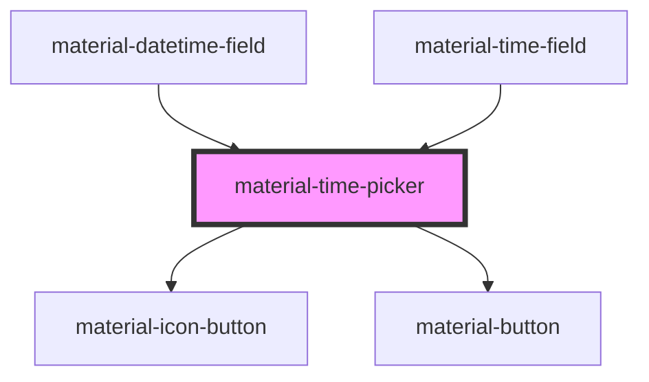

# material-time-picker

<!-- Auto Generated Below -->

## Properties

| Property      | Attribute      | Description                                                                                                                                                                | Type                | Default   |
| ------------- | -------------- | -------------------------------------------------------------------------------------------------------------------------------------------------------------------------- | ------------------- | --------- |
| `headline`    | `headline`     | Override the headline in the top-left of the picker container. Defaults to a localised "Select time" / "Enter time" depending on whether the dial or input view is active. | `string`            | `''`      |
| `hideActions` | `hide-actions` | Hide the footer's Cancel + OK buttons. The host (e.g. material-time-field) may render its own dialog actions instead. The view-toggle stays visible.                       | `boolean`           | `false`   |
| `locale`      | `locale`       | Override locale for default-mode resolution.                                                                                                                               | `string`            | `''`      |
| `maximum`     | `maximum`      | Latest selectable time as `HH:MM`. Empty = no upper bound.                                                                                                                 | `string`            | `''`      |
| `minimum`     | `minimum`      | Earliest selectable time as `HH:MM`. Empty = no lower bound.                                                                                                               | `string`            | `''`      |
| `mode`        | `mode`         | `'12'` (AM/PM) or `'24'`. Defaults to the locale's preference via `Intl.DateTimeFormat(...).resolvedOptions().hour12`.                                                     | `"12" \| "24"`      | `'24'`    |
| `precision`   | `precision`    | Granularity of selectable times as `HH:MM`. Default `00:01` allows any minute. `00:15` snaps to quarters; `01:00` only allows on-the-hour.                                 | `string`            | `'00:01'` |
| `value`       | `value`        | Selected time as ISO 24h `HH:MM`. Empty string = no selection (defaults to current time on first render so the dial has a starting point).                                 | `string`            | `''`      |
| `view`        | `view`         | Active view inside the picker. Toggled by the keyboard/clock icon.                                                                                                         | `"dial" \| "input"` | `'dial'`  |

## Events

| Event          | Description | Type                                             |
| -------------- | ----------- | ------------------------------------------------ |
| `pickerCancel` |             | `CustomEvent<void>`                              |
| `pickerOk`     |             | `CustomEvent<{ value: string; }>`                |
| `valueChange`  |             | `CustomEvent<{ value: string; }>`                |
| `viewChange`   |             | `CustomEvent<{ view: MaterialTimePickerView; }>` |

## Dependencies

### Used by

 - [material-datetime-field](../material-datetime-field)
 - [material-time-field](../material-time-field)

### Depends on

- [material-icon-button](../material-icon-button)
- [material-button](../material-button)

### Graph

----------------------------------------------

*Built with [StencilJS](https://stenciljs.com/)*
