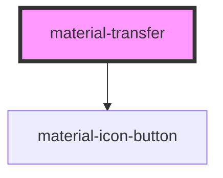

# material-transfer

<!-- Auto Generated Below -->

## Properties

| Property         | Attribute         | Description                                                   | Type                            | Default     |
| ---------------- | ----------------- | ------------------------------------------------------------- | ------------------------------- | ----------- |
| `availableLabel` | `available-label` |                                                               | `string`                        | `''`        |
| `chosenLabel`    | `chosen-label`    |                                                               | `string`                        | `''`        |
| `disabled`       | `disabled`        |                                                               | `boolean`                       | `false`     |
| `filter`         | `filter`          | Per-side search boxes.                                        | `boolean`                       | `true`      |
| `name`           | `name`            |                                                               | `string \| undefined`           | `undefined` |
| `options`        | --                | Options provided from JS instead of slotted material-options. | `TransferOption[] \| undefined` | `undefined` |
| `required`       | `required`        |                                                               | `boolean`                       | `false`     |
| `size`           | `size`            | Visible rows per panel (sets the panel height).               | `number`                        | `8`         |
| `values`         | --                | Chosen values — source of truth.                              | `string[]`                      | `[]`        |

## Events

| Event         | Description | Type                                 |
| ------------- | ----------- | ------------------------------------ |
| `valueChange` |             | `CustomEvent<{ values: string[]; }>` |

## Methods

### `getValues() => Promise<string[]>`

#### Returns

Type: `Promise<string[]>`

## Dependencies

### Depends on

- [material-icon-button](../material-icon-button)

### Graph

----------------------------------------------

*Built with [StencilJS](https://stenciljs.com/)*
