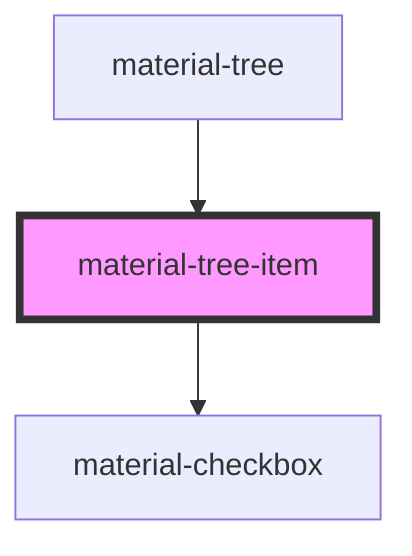

# material-tree-item

<!-- Auto Generated Below -->

## Properties

| Property         | Attribute         | Description                                                                                                                 | Type                  | Default     |
| ---------------- | ----------------- | --------------------------------------------------------------------------------------------------------------------------- | --------------------- | ----------- |
| `checked`        | `checked`         |                                                                                                                             | `boolean`             | `false`     |
| `dense`          | `dense`           |                                                                                                                             | `boolean`             | `false`     |
| `depth`          | `depth`           |                                                                                                                             | `number`              | `0`         |
| `disabled`       | `disabled`        |                                                                                                                             | `boolean`             | `false`     |
| `expanded`       | `expanded`        |                                                                                                                             | `boolean`             | `false`     |
| `hasChildren`    | `has-children`    | Chevron for lazy nodes whose children are not in the DOM yet (mptt: has-children). | `boolean`             | `false`     |
| `icon`           | `icon`            | Material Symbols ligature before the label.                                                                                 | `string \| undefined` | `undefined` |
| `indeterminate`  | `indeterminate`   |                                                                                                                             | `boolean`             | `false`     |
| `label`          | `label`           |                                                                                                                             | `string \| undefined` | `undefined` |
| `level`          | `level`           | Explicit depth for flat (mptt-style) markup; nested markup derives it.                                                      | `number \| undefined` | `undefined` |
| `loading`        | `loading`         |                                                                                                                             | `boolean`             | `false`     |
| `selectable`     | `selectable`      |                                                                                                                             | `boolean`             | `false`     |
| `supportingText` | `supporting-text` |                                                                                                                             | `string \| undefined` | `undefined` |
| `value`          | `value`           |                                                                                                                             | `string`              | `''`        |

## Events

| Event                  | Description | Type                                                 |
| ---------------------- | ----------- | ---------------------------------------------------- |
| `materialTreeActivate` |             | `CustomEvent<{ value: string; }>`                    |
| `materialTreeChecked`  |             | `CustomEvent<{ value: string; checked: boolean; }>`  |
| `materialTreeToggle`   |             | `CustomEvent<{ value: string; expanded: boolean; }>` |

## Shadow Parts

| Part    | Description |
| ------- | ----------- |
| `"row"` |             |

## Dependencies

### Used by

 - [material-tree](.)

### Depends on

- [material-checkbox](../material-checkbox)

### Graph

----------------------------------------------

*Built with [StencilJS](https://stenciljs.com/)*
